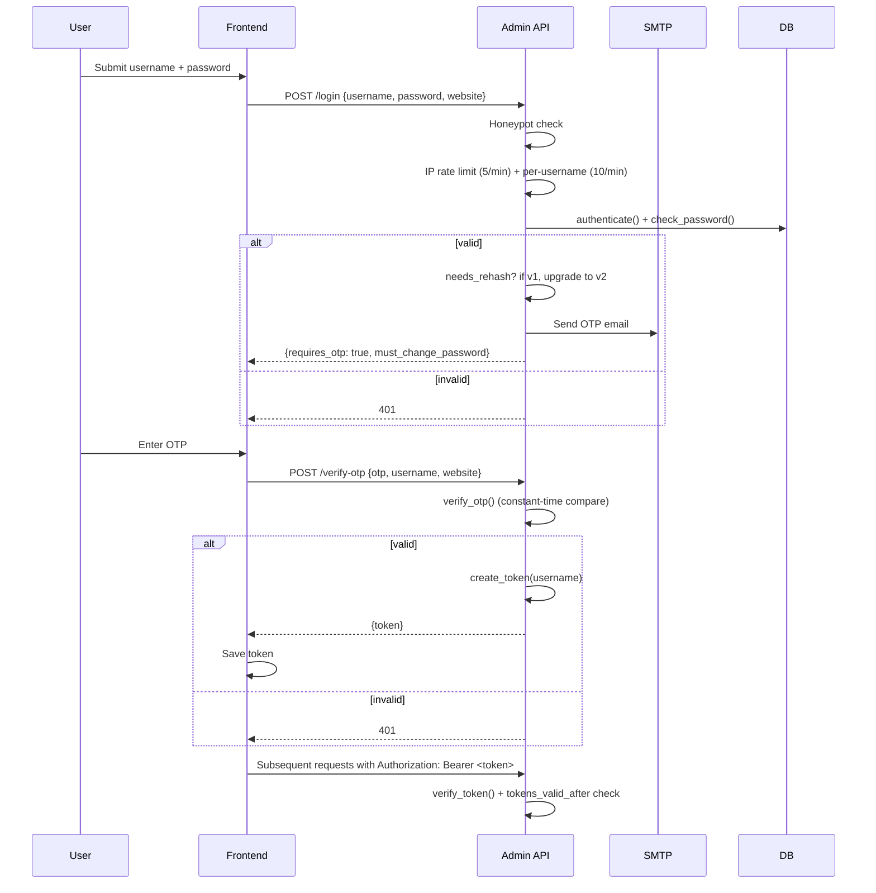

# Auth & Security

The admin panel is the only thing on this stack that talks to a credentialed user. Everything below is about that panel. The platform sub-apps (`/wiki`, `/git`, `/store`) are public read-only and have no auth surface.

## Threat model

The admin is the highest-value target. An attacker who can read or write any of `User`, `Project`, `SEOSetting`, `Personal`, or `WikiArticle` owns the portfolio. So the auth layer has to defend against:

- Credential stuffing and password brute force
- Token theft (XSS, network sniff, log leak)
- Token replay
- Privilege escalation
- Session fixation / parallel sessions
- CORS bypass from a malicious origin
- Logout that doesn't actually log out

## Authentication flow



## Password storage

PBKDF2-HMAC-SHA256, 16-byte salt, **600,000 iterations** (OWASP 2023+ baseline). Hashes are versioned:

```
v2:600000:<salt_hex>:<digest_hex>
```

The `v2:` prefix lets us roll the algorithm in the future without a forced re-migration. Old `salt:hash` rows (v1, 100k iterations) still verify — `check_password` falls back — and `authenticate()` transparently upgrades the row to v2 on the next successful login. No "expired password" prompt for the user, no forced reset.

## Token format

Custom HMAC token instead of JWT. Format:

```
<username>:<unix_ts>:<hex_sig>
```

`hex_sig = HMAC-SHA256(ADMIN_SECRET_KEY, "<username>:<unix_ts>")`. The token is verified in `verify_token()`:

1. Split on the last two `:`.
2. `hmac.compare_digest` against the recomputed signature.
3. Reject if older than `ADMIN_SESSION_EXPIRY` (default 12h).
4. Reject if `issued_at < user.tokens_valid_after` (see below).

Returns the username. The route handlers use that to identify the caller.

The format is deliberately minimal — no `kid`, no `nbf`, no audience. If we need to rotate `ADMIN_SECRET_KEY` we add a `kid` to the token and a key ring. Until then, rotating the secret kills all sessions, which is the desired blast radius.

## Session revocation

Every User has a `tokens_valid_after` timestamp. Bumped by:

- `change_password()` — `auth.py`
- `reset_password_with_token()` — `auth.py`
- `/logout` route — `__init__.py` (now real, not a stub)

`verify_token()` rejects any token whose `issued_at` is earlier than `tokens_valid_after`. So password change and logout invalidate every other device the admin has ever logged in from. The frontend `clearToken()` in `localStorage` is the cosmetic part; the server check is the real one.

## OTP

- 6 digits, generated with `secrets.randbelow(1_000_000)` (CSPRNG, **not** `random.randint`).
- Stored in an in-process dict keyed by email, with the issuance timestamp.
- 10-minute expiry.
- Compared with `hmac.compare_digest`.
- Deleted on first successful verify (one-time use).
- If SMTP is not configured, `send_otp` returns `None` and the login endpoint returns 400. No silent fallback to printing the OTP.

## Password reset

- 32-byte URL-safe token from `secrets.token_urlsafe`.
- Stored in the DB as `sha256(token).hexdigest()` (the raw token is never persisted).
- 30-minute expiry.
- `forgot-password` is constant-time from the attacker's perspective: it always returns the same response shape whether or not the email exists, and a 0–3s jitter on the SMTP send would be a good future addition.
- Successful reset bumps `tokens_valid_after` (kills any stolen session in flight).

## Rate limiting

In-memory sliding window keyed by either the client IP or a username. Two layers:

| Key | Limit | Endpoint |
|---|---|---|
| IP | 5 / 60s | `/login` |
| IP | 5 / 60s | `/verify-otp` |
| IP | 3 / 300s | `/forgot-password` |
| IP | 5 / 60s | `/reset-password` |
| IP | 5 / 60s | `/change-password` |
| Username | 10 / 60s | `/login` |
| Email | 3 / 300s | `/forgot-password` |

**Proxy trust**: the rate limiter reads `request.remote_addr` (the real TCP peer) by default. It only consults `X-Forwarded-For` when the immediate peer is in the `TRUSTED_PROXIES` env var. Without `TRUSTED_PROXIES` configured, an attacker can't bypass the limit by rotating headers.

For multi-worker production, swap the `check()` storage from the in-process dict to Redis. The function signature stays the same.

## CORS

- Allowed origins come from `CORS_ALLOWED_ORIGINS` (comma-separated). No wildcards.
- Preflight is handled in two places to be safe: the main app's `CORSMiddleware` (Lcore built-in, pre-routing) and the admin sub-app's `before_request` / `after_request` hooks. Belt and suspenders against the case where the pre-routing middleware loses headers on a 4xx response from a mounted sub-app.
- `Access-Control-Allow-Credentials: true` is set only when the origin is in the allow list.
- `Vary: Origin` is set so caches don't mix responses between origins.

## Security headers

Every admin response carries:

```
X-Content-Type-Options: nosniff
X-Frame-Options: DENY
Referrer-Policy: strict-origin-when-cross-origin
Permissions-Policy: geolocation=(), camera=(), microphone=()
Content-Security-Policy: default-src 'none'; frame-ancestors 'none'; base-uri 'none'
Strict-Transport-Security: max-age=31536000; includeSubDomains
```

HSTS is on by default; set `ADMIN_HSTS=false` for local HTTP development.

## Honeypot

Every auth POST carries a hidden `website` field. If the field is non-empty, the request is rejected with 400 and logged as `status=rejected detail=honeypot`. Real users (and well-behaved bots) never fill it. A spam bot that fills every visible field fills this one too.

The honeypot is **enforced on the server**, not just the React form. The frontend always sends the field (empty for humans), so a `curl` POST that omits it still passes; one that sets it gets rejected.

## Audit log

Every auth event writes a row to `audit_logs`:

| Column | Notes |
|---|---|
| `id` | PK |
| `user_id` | Nullable — failed logins can be from a username that doesn't exist |
| `username` | Captured at request time even if no user matched |
| `action` | `login`, `verify-otp`, `change-password`, `forgot-password`, `reset-password`, `logout` |
| `target` | Optional resource identifier |
| `ip` | `X-Forwarded-For` first hop (or `remote_addr` if no proxy) |
| `user_agent` | First 500 chars |
| `status` | `success` / `invalid` / `rejected` / `rate_limited` / `weak_password` / `invalid_current` / `otp_send_failed` / `requested` |
| `detail` | Free text — e.g. `honeypot` for spam rejections |
| `created_at` | UTC timestamp |

Quick query for the recent failures:

```sql
SELECT created_at, username, ip, action, status, detail
FROM audit_logs
WHERE status != 'success'
ORDER BY created_at DESC
LIMIT 50;
```

## Startup guard

`main.py` refuses to boot if `ADMIN_SECRET_KEY` is the framework default. The check is at the very top of the file, before any route is imported, so a misconfigured prod deploy fails loudly rather than silently.

`ADMIN_PASSWORD` is **not** checked at boot — it is only consumed by `seed.py` and `cli.py`, and those generate a random 24-character password if the env value is missing or the default. See [SETUP.md](./SETUP.md) for the recommended seed flow.

## What it explicitly does not do any of the following

- It does not rotate sessions on activity. A 12h token is just a 12h token; making it sliding-window would mean the server tracks more state and the frontend has to refresh tokens. Out of scope for a single-admin portfolio.
- It does not do per-IP "lockout" beyond the rate limit. That punishes shared NAT'd users more than attackers.
- It does not store OTPs in the DB. The trade-off is that a process restart invalidates in-flight OTPs, but OTPs are 10-minute single-use, so the worst case is the user has to re-login. For a single admin this is fine; for a multi-user system, switch to Redis or DB-backed storage.
